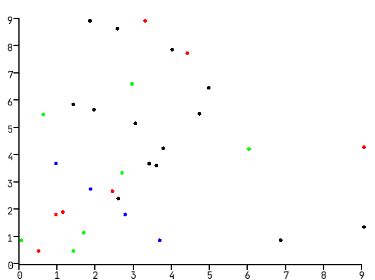

# plotingZ

PlotingZ is a data visualization library written in C++. The core of this project uses the SFML library to visualize the data.
Other libraries used in the project:
- [fmt](https://github.com/fmtlib/fmt)
- [Google Test](https://github.com/google/googletest)

## Installation
In order to build and execute plottingZ, install the following library:
`sudo apt install libsfml-dev` 

After that, build the project, set some input data and you should be ready to go! :)

## Preview
Visualization of input data with the scatter plot:

## Notes
Following plots types are currently available:
* Scatter plot
