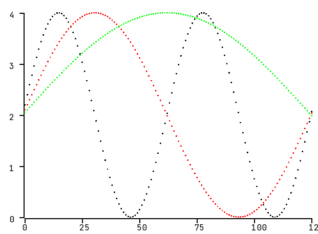
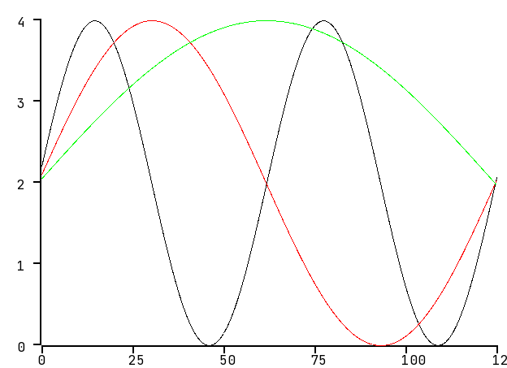

# plotingZ

PlotingZ is a data visualization library written in C++ which is based on [SFML](https://www.sfml-dev.org/).
Other libraries used in the project:
- [fmt](https://github.com/fmtlib/fmt)
- [Google Test](https://github.com/google/googletest)

## Installation
In order to build and execute plottingZ, install the following library:
`sudo apt install libsfml-dev`

To build the project, [Bazel](https://www.bazel.build/) is needed. The installation instructions can be found [here](https://docs.bazel.build/versions/master/install-ubuntu.html).

After the needed libraries are installed, build the project, set some input data and you should be ready to go! :)
An example can be seen in the `Plot/main_run.cpp` [file](https://github.com/zpervan/plotingZ/blob/master/Plot/main_run.cpp).

## Preview
Input data visualized with the scatter plot:

Scatter plot sine waves:

Line plot sine waves:

## Notes
Following features are available:

Common:
* Axis which values scale on input data
* Legend

Plots:
* Scatter
* Line

## Features to be developed
Common:
* Grid

Plots:
* Histogram

## Known issues

* Rightmost axis value is cut-off due to the value text is exceeding screen dimension
* Currently, does not support negative input data values
* Plotted data is blocking legend data text box
 
## Support

Big thanks to [JetBrains](https://www.jetbrains.com/?from=plotingZ) for supporting this project with 
a free open-source CLion license.

