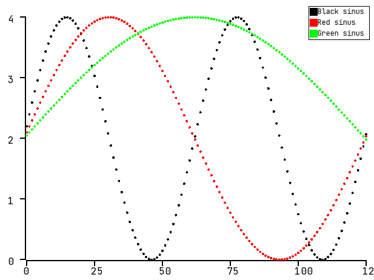
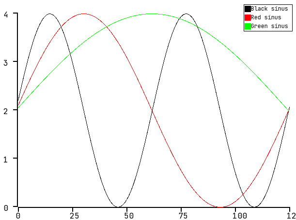

# plotingZ #
 [](https://ci.appveyor.com/project/zpervan/plotingz)


PlotingZ is a data visualization library written in C++ which is based on [SFML](https://www.sfml-dev.org/).
Other libraries used in the project:
- [fmt](https://github.com/fmtlib/fmt)
- [Google Test](https://github.com/google/googletest)

Any contribution from your side is highly appreciated so feel free to fork this project and make some pull request. Under the [issues](https://github.com/zpervan/plotingZ/issues) tab you can find some taks on which you can start to work on.

## Installation for developers ##

### Windows ###

1. Install Microsoft Visual Studio C++ environment for C++ desktop application development.
2. Download [Bazel](https://docs.bazel.build/versions/main/install-windows.html) stable version `4.2.1` and follow the installation steps. For convenient easons, rename the downloaded executable from `bazel-4.2.1-windows-x86_64.exe` to `bazel.exe`.  
3. Open your terminal located at the root of the project and run the following command to build the project `bazel build --config=windows //...`
4. To run the application, type the following command `bazel run --config=windows //Plot:main_run`

### Linux Ubuntu ###

1. Download [Bazel](https://docs.bazel.build/versions/main/install-ubuntu.html) stable version `4.2.1` and follow the installation steps.
2. In this project, we use `clang` as the main compiler for developent. Execute the following command to install the developement environment:
```bash
sudo apt-get install build-essential git clang clang-format clang-tidy
```
3. Open your terminal located at the root of the project and run the following command to build the project `bazel build --config=linux //...`
4. To run the application, type the following command `bazel run --config=linux //Plot:main_run`

----

After the needed libraries are installed, build the project, set some input data and you should be ready to go! :)
An example can be seen in the `Plot/main_run.cpp` [file](https://github.com/zpervan/plotingZ/blob/master/Plot/main_run.cpp).

## Preview ##

Scatter plot sine waves:



Line plot sine waves:



## Notes ##
Following features are available:

Common:
* Axis which values scale on input data
* Legend

Plots:
* Scatter
* Line

## Features to be developed ##
Common:
* Grid

Plots:
* Histogram

## Known issues ## 

* Rightmost axis value is cut-off due to the value text is exceeding screen dimension
* Currently, does not support negative input data values
* Windows application works only in `Release` mode and the `SFML` .dll files must be manually copied to the build folder. 
## Support ##

Big thanks to [JetBrains](https://www.jetbrains.com/?from=plotingZ) for supporting this project with 
a free open-source CLion license.


