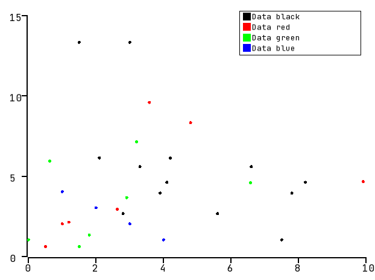
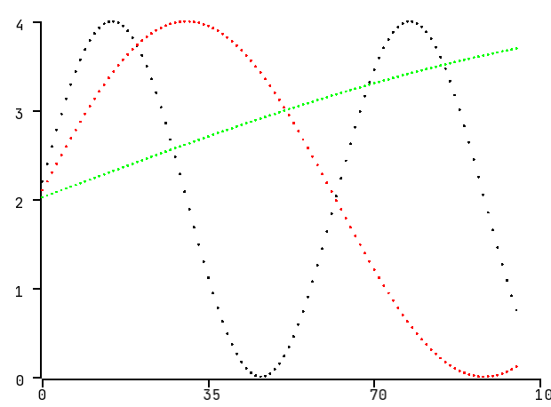

# plotingZ

PlotingZ is a data visualization library written in C++. The core of this project is based on the SFML library 
which is used to visualize the data.
Other libraries used in the project:
- [fmt](https://github.com/fmtlib/fmt)
- [Google Test](https://github.com/google/googletest)

## Installation
In order to build and execute plottingZ, install the following library:
`sudo apt install libsfml-dev` 

After that, build the project, set some input data and you should be ready to go! :)
An example can be seen in the `Plot/main_run.cpp` file.

## Preview
Input data visualized with the scatter plot:

Sine wave example:

## Notes
Following features are available:

Common:
* Axis which values scale on input data
* Legend

Plots:
* Scatter
* Line

## Features to be developed
Common:
* Grid

Plots:
* Histogram

## Known issues

* Rightmost axis value is cut-off due to the value text is exceeding screen dimension
* Currently, does not support negative input data values
 
## Support

Big thanks to [JetBrains](https://www.jetbrains.com/?from=plotingZ) for supporting this project with 
a free open-source CLion license.

